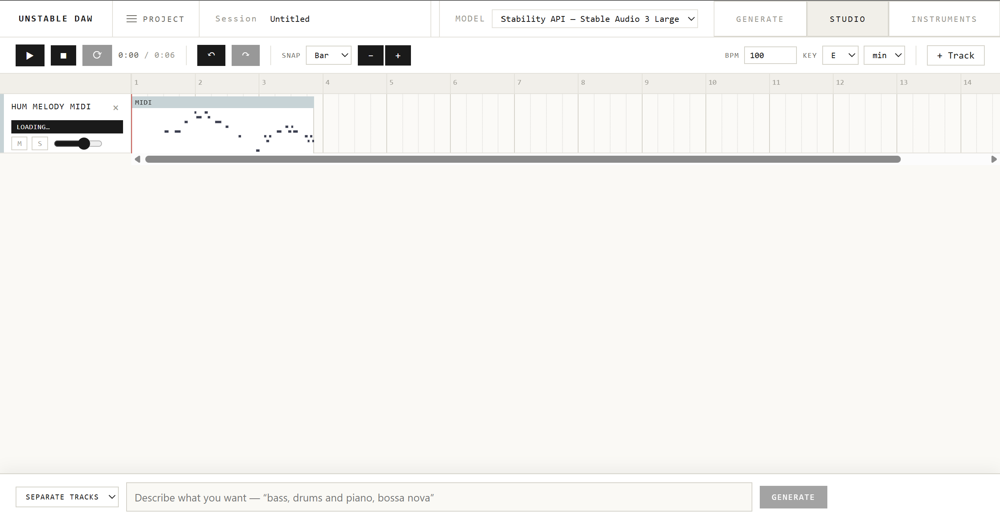
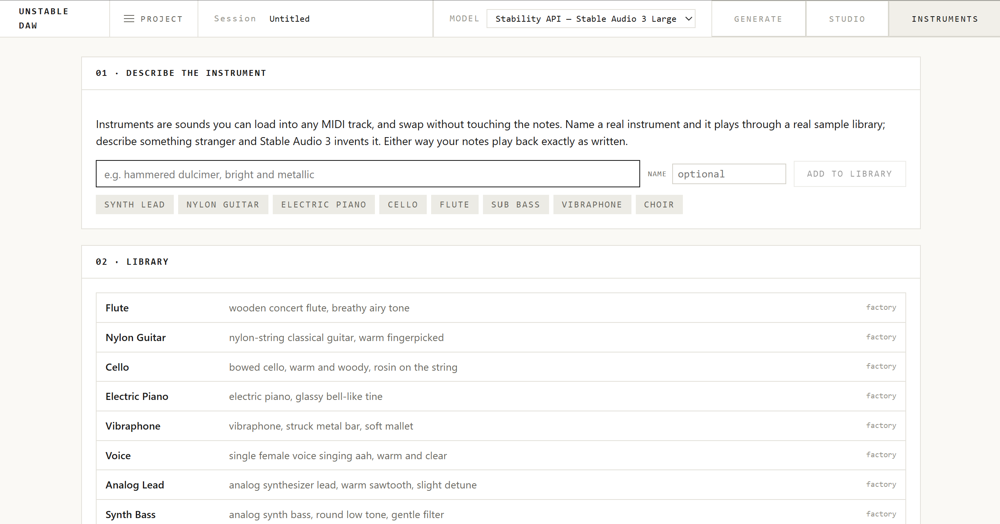

# Unstable DAW

Hum a tune into your laptop, get it back as notes you can edit, then ask for a
band to play along with it. Unstable DAW is a small music workstation that runs
in the browser and uses Stable Audio 3 to fill in the parts you can't play
yourself.



We built it in a weekend at the **Music Tech Hackathon Montreal** (August 22-23,
2026) for the Stability AI track. The brief was to make something for musicians
using Stable Audio 3. We kept coming back to the same moment: you have a melody
stuck in your head, you're not near an instrument, and by the time you've found
one or opened a real DAW the idea has gone. So the app starts there. You hum,
and everything else gets built around what you hummed.

## What you can do with it

**Turn a hum into MIDI.** Record straight from the mic or upload a file on the
Generate tab. One line only: a hum, a whistle, a sung phrase. The app works out
the tempo and key and turns the pitch into notes. You pick whether it becomes a
melody or a bassline. If it gets the tempo or key wrong you can fix it before
anything is written.

**Edit it like a normal DAW.** The Studio has a timeline with multiple tracks,
a piano roll for MIDI clips, snap to grid, split, duplicate, undo/redo, and
mute/solo. You can also record or import audio onto a track.

**Ask for the rest of the band.** The bar at the bottom of the Studio takes plain
English, like *"bass, drums and piano, bossa nova"* or *"something slow and sad
for a rainy night"*. A language model reads the request and turns it into a
list of concrete edits: which tracks to add, at what tempo and key, in what
style. The app then carries those out with the same functions the buttons use.
When you ask for several parts at once, Stable Audio renders them as one
performance and we split that recording into stems, so the drums and bass
actually sound like they were in the same room.

**Make your own instruments.** Any MIDI track can load any instrument, and
swapping it never touches the notes.



If you type the name of a real instrument (cello, nylon guitar, vibraphone) it
plays through a sampled recording of that instrument. If you describe something
that doesn't exist, like *"glass bells underwater"*, Stable Audio generates a few
one-shot samples and the app pitches them across the keyboard. In both cases
your notes play back exactly as you wrote them.

**Take it with you.** Export gives you a zip with every stem as a WAV, the MIDI,
your original recording, and a manifest of the prompt, seed and settings behind
each part, so you can drag it all into Ableton or Logic and keep going.

## How it works

Stable Audio 3 is a text-to-audio model. It has no way to accept a melody or a
chord progression, and it doesn't output separate instruments. If you give it
your hum as the starting audio, one of two things happens. Keep the noise low
and your voice is still audible in the result. Push it higher and the timing
falls apart.

What we do instead is give it a **guide track**. We analyze the hum, write the
part we want as MIDI, render that MIDI with a deliberately plain synth, and hand
that to Stable Audio as the starting audio. The rhythm and pitches are already
baked into what the model starts from, so it keeps the skeleton and replaces the
sound. The result comes out in time, in key, and mostly just the instrument we
asked for.

```
hum.wav
  1. ANALYZE       notes, tempo, key, bar grid
  2. TRANSFORM     hum -> melody or bassline MIDI
  3. REVIEW        you fix tempo/key and edit notes
  4. RENDER GUIDE  MIDI -> plain synth WAV
  5. GENERATE      Stable Audio 3, audio-to-audio from the guide
  6. ALIGN         stretch and nudge the result back onto the grid
```

For full-band requests there's an extra step: generate the whole arrangement as
one master, then separate it into stems with Demucs, using the MIDI we wrote to
decide what belongs where.

[PLAN.md](PLAN.md) has the original design and the reasoning behind it, and the
`docs/` folder has notes on the individual pieces.

## Running it

You'll need Python 3.11+, Node.js, and [uv](https://docs.astral.sh/uv/). The setup
scripts install uv if it's missing, grab `rubberband` for time-stretching, install
the Python packages and build the frontend.

macOS / Linux:

```bash
./scripts/setup.sh
```

Windows (PowerShell):

```powershell
powershell -ExecutionPolicy Bypass -File scripts\setup.ps1
```

On Windows `rubberband` is optional. Without it the app falls back to librosa's
time-stretching.

Then copy the example environment file and start the server:

```bash
cp .env.example .env        # Windows: copy .env.example .env
uv run uvicorn backend.api:app --reload
```

Open http://127.0.0.1:8000.

That's enough to click around. With no keys set, pick the **Mock** model in the
header: it returns noisy versions of the guide instantly, so you can try the whole
flow offline without spending anything.

### API keys

Both go in `.env`. Restart the server after changing it.

| Key | What it unlocks |
|---|---|
| `STABILITY_API_KEY` | Stable Audio 3 Large through the Stability API. Best quality. Get a key at [platform.stability.ai](https://platform.stability.ai/account/keys). |
| `DEEPSEEK_API_KEY` | The plain-English bar in the Studio. Without it, a simple keyword parser handles requests like "bass and drums, funk" but won't follow anything more subtle. |

### Choosing a model

The model dropdown in the header lists what your machine can actually use.
Anything unavailable is greyed out. If a generation fails partway through, the
server retries on a backend that works and tells you which one ran.

| Model | Setup | Notes |
|---|---|---|
| Mock | none | Instant and offline. For trying the UI. |
| Stability API | `STABILITY_API_KEY` | Stable Audio 3 Large. Uses credits and needs a connection. |
| Local | `uv sync --extra local` plus Hugging Face access to the weights | Free and offline, but slower. Runs `small-music` on CPU anywhere; `medium` needs an NVIDIA GPU. |

On Apple Silicon there's also a faster MLX runtime for local generation. Clone
Stability's repo next to this one and install it:

```bash
cd ..
git clone --depth=1 https://github.com/Stability-AI/stable-audio-3 sa3-mlx-src
cd sa3-mlx-src/optimized/mlx
./install.sh -y
```

The app looks for it at `../sa3-mlx-src/optimized/mlx`. If you put it somewhere
else, set `BTG_MLX_ROOT`. Set `BTG_MLX_DIT=sm-music` to force the smaller, faster
model.

### Working on the frontend

For hot reload, keep the Python server running and start Vite alongside it. It
proxies `/api` to port 8000.

```bash
npm --prefix web run dev
```

## Studio shortcuts

| Key | Action |
|---|---|
| Space | Play / pause |
| S | Split the selected clip at the playhead |
| D | Duplicate the selected clip or region |
| Delete / Backspace | Delete the selected clip or region |
| Ctrl/Cmd + Z | Undo (add Shift to redo) |
| + / - | Zoom in / out |
| Esc | Clear the selected region |

## Command line

The CLI is quicker than the UI when you're tuning prompts or noise levels.

```bash
uv run python scripts/make_test_vocals.py      # generate test hums with known tempo/key

uv run btg --input samples/fixtures/amin_100.wav --hum-target melody
uv run btg --input samples/fixtures/amin_100.wav --part bass --style "bossa nova"
uv run btg --input samples/fixtures/amin_100.wav --part bass --sweep 0.5,0.65,0.8,0.9
```

`--sweep` renders the same part at several noise levels. Noise controls how far
the model is allowed to wander from the guide, and it matters more than any other
setting. There's no right value on paper, you have to listen. Output goes to
`sessions/<id>/`.

To check what the analysis hears before anything gets generated:

```bash
uv run analysis-test --input samples/fixtures/amin_100.wav
```

## Project layout

```
backend/
  api.py             HTTP routes (FastAPI). Kept thin.
  pipeline.py        runs the stages in order; the only file that knows the order
  analysis.py        tempo, key, bar grid
  pitch_tracking.py  hum -> note events
  hum_transform.py   note events -> melody or bassline MIDI
  arrange.py         writes the MIDI for each backing part
  grooves.py         rhythm patterns per genre
  render_guide.py    MIDI -> guide WAV
  prompts.py         prompt text per part
  sa3_backend.py     mock / local / api behind one interface
  align.py           snaps generated audio back to the grid
  separate.py        splits a full-band master into stems (Demucs)
  mix.py             EQ and levels so separately made stems sit together
  agent.py           plain-English request -> list of Studio actions
  interpret.py       plain-English request -> generation plan
  compose.py         plain-English description -> MIDI phrase
  instruments.py     one-shot samples for generated instruments
  session.py         on-disk projects and their provenance record
  cli.py             command-line runner
web/src/
  App.jsx            app state, tabs, project open/save/export
  components/        Studio, piano roll, recorder, instruments
  useTimeline.js     playback engine and track/clip state
  useSampler.js      plays MIDI through soundfonts or generated samples
scripts/             setup and test fixture generation
sessions/<id>/       each project's audio, MIDI and meta.json
```

## Tests

```bash
uv run --with pytest python -m pytest backend/test   # backend
npm --prefix web test                                # frontend
npm --prefix web run test:timeline                   # timeline edit operations
```

One of the backend tests reads the synthetic fixtures, so run
`uv run python scripts/make_test_vocals.py` first.

Tempo and key detection have their own accuracy suite with 18 fixtures of known
tempo and key. The hard half adds rubato, room noise, detuning and melodies that
avoid the tonic. Run it after touching `analysis.py` or `melody.py`, since a
single test file can't tell a real improvement from a lucky one.

```bash
uv run python scripts/eval_analysis.py
```

Currently 18/18 on tempo and 18/18 on key.

### Why key detection looks at phrase endings

A minor key and its relative major use exactly the same notes, so counting which
pitches show up can't tell A minor from C major. What gives it away is where the
melody comes to rest. `analysis.py` scores all 24 keys against a pitch profile and
then adds weight for the tonic showing up at the ends of phrases and on the first
and last notes. On the hard fixtures that took us from 4/8 to 8/8.

## Known limitations

- Chords guessed from a single sung line are shaky. One melody fits plenty of
  progressions, so treat them as a starting point.
- Everything assumes 4/4.
- Breathy or noisy recordings give worse notes. Hum close to the mic, one note at
  a time.
- Our accuracy numbers come from synthetic test hums. Real voices have more
  vibrato and breath, so expect it to miss more often.
- Generated instruments are pitch-shifted one-shots. They sound fine for short
  notes but they're not a replacement for a real sampled instrument.

## Team

Made at Music Tech Hackathon Montreal 2026 by Dylan H, Le-Tao Li and Gilberto
Tumangday.
